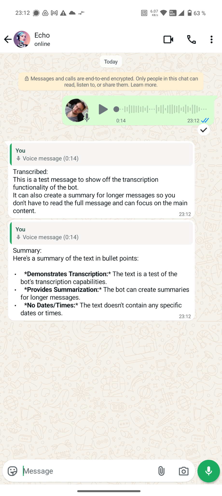
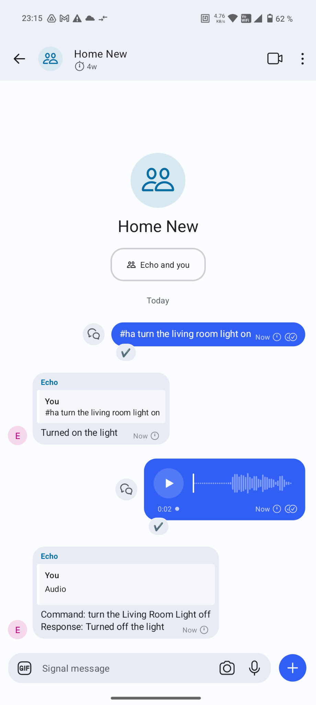

# SMRT ChatBot

## Introduction

SMRT ChatBot is a multi-platform messaging bot designed to integrate with popular services like WhatsApp, Signal, and Telegram.

It enables seamless communication, automation, and control of smart home devices through Home Assistant.

The bot supports text and voice commands, message sending via REST API, and advanced features like voice transcription and AI-powered summaries.

### Voice Transcription

Always getting endless voice messages from friends? Add this bot to the group or forward the voice message to it and it will give you a transcription and an AI summary.



### Talk to your Home

The bot allows you to forward commands and voice messages to be processed by Homeassistant.



You can send text commands like in homeassistant chat via:

```txt
#ha turn the living room light on
```

You can also use the announce functionality. For this to work you need to tag the assistant device with the label `sayCommand`. The command will call all assistants.

Then you can use:

```txt
#say Announce something. 
```

## Build & Run

To build the project using Docker Compose, run:

```bash
docker compose build
```

This command will build all services defined in your `docker-compose.yml` file. Make sure Docker and Docker Compose are installed on your system.

Before running the project, ensure you have set up your `config.yml` file in the root directory with the necessary configuration for your messaging platforms.

To start the services, run:

```bash
docker compose up
```

This will launch the bot.

## Configuration

Configuration is done in a `config.yml` file in the root of the project.

### Development

For development an additional flag can be set. This will do the following modifications:

* Use flask development webserver for message end point and galleries

Set the debug setting to enable it. 

```yml
debug:
```

### Whatsapp Messenger

Whatsapp can be integrated using [WPPConnect Server](https://github.com/wppconnect-team/wppconnect-server) project on GitHub. Install wpp-connect server and configure the endpoint in the bot configuration as follows.

```yml
whatsapp:
  wppconnect_api_key: "Generated API Key"
  wppconnect_server: "http://127.0.0.1:21465"
  wppconnect_session_name: "smrt" # the session name for wppconnect-server for which the api keys is valid
  lid: 153279329759289@lid # optional: the lid of the account, used to identify if the bot was tagged
```

### Signal Messenger

Signal Messenger can be integrated using the [signal-cli-rest-api](https://github.com/bbernhard/signal-cli-rest-api) project on GitHub.

Install the signal-cli REST API server and register your number with it.

Then configure the endpoint in the bot configuration as follows.

```yml
signal:
  host: 127.0.0.1
  port: 8080
  number: "+491712345678"
```

### Telegram Messenger

To integrate Telegram Messenger, you need to obtain a bot token. Follow the [official Telegram Bot tutorial](https://core.telegram.org/bots/tutorial#obtain-your-bot-token) to create a bot and get your token.

Additionally you have to set Privacy for groups to disabled for commands to work properly. Go to Botfather in Telegram, click edit bot settings and chose Group Privacy. Then set it to disabled. This allows the bot to read and respond to all group messages.

```yml
telegram:
  telegram_api_key: "XXXX:YYYY" 
```

### Ollama and llama.cpp

Ollama or llama.cpp can be used in some of the commands, e.g. for summaries in voice transcriptions. When using Ollama and the model is not yet downloaded, the bot will try to request and download the model through ollama.

Configure ollama with the following settings.

```yml
ai: 
  - ollama: 
      name: "ollama:gemma3:12b" # identifer to use in other parts of config
      model: "gemma3:12b" # nodel name
      host: "http://ha.homebrain.dev:11434" # host address of api host
  - llama_cpp:
      name: "llama_cpp:gemma3:12b" # identifer to use in other parts of config
      model: "gemma3:12b" # nodel name
      host: "http://ha.homebrain.dev:8002" # host address of api host

```

Models in other configuration entries can be chosen by using the name from the `name` field. 

### Message GPT Answering

This feature allows to ask the chatbot questions to the messages in the chat. 

```yaml
message_gpt:
  answer_bot: "llama_cpp:gemma3:12b" # bot to use for answering messages
  max_chat_history_messages: 20 # optional: number of previous messages to include in the context

```

### Gallery Creation

The gallery allows to collect images that people upload in groups. When gallery creation is turned on via `#gallery on`, all images are uploaded to the /storage folder. A webserver is created from which you can view and download all images.

* Turn gallery on for the group via `#gallery on`
* Get the link to the group via `#gallery`
* Open the link, view and download all uploaded images
* Storing images can be disabled again via `#gallery off`
* `#gallerydelete` can delete the existing images

```yml
gallery: # enable gallery
  base_url: "http://localhost:9000" # Base URL where the gallery web interface will be hosted
  port: 9000 # Optional: Port for the gallery web interface (default 9000)
```

### Homeassistant Command Processing

The bot allows to send homeassistant commands either as text or as voice commands.

For voice commands you must set up a voice pipeline, e.g. using Nabu Casa's subscription or local processing with speech-to-phrase or whisper (see <https://www.home-assistant.io/blog/2025/02/13/voice-chapter-9-speech-to-phrase/>).

Example: `#ha turn the living room light on`

In the configuration the whitelist is mandatory. This is for you to define in which groups or from which senders the bot should process homeassistant commands.

To get the token, go to your Profile in homeassistant - Security and then click `Create Token` at the bottom of the ling-lived access token list.

```yml
homeassistant: 
  token: "HOMEASSISTANT_TOKEN"
  ws_api_url: "ws://homeassistantIP:8123/api/websocket"
  chat_id_whitelist: [
    "signal://XXXX", # Signal Home Group
    "whatsapp://123456@g.us" # Whatsapp Home group
    ]
  process_without_command: true # optional, default = false - if true, will process any text command without the #ha prefix
```

### Gaudeam Integration

Gaudeam.de is a platform for clubs. The integration allows to fetch information like events or birthdays. It's possible to configure multiple accounts by adding them as a list.

Available commands:

* `#gaubday` gets a list of members that have birthday today
* `#gauevents` gets a list of of upcoming events in the next days

```yml
gaudeam:
  - user_email: "bla@blubb.de" # User Email of the account
    user_password: "mypassword" # The password of the account
    chat_id_whitelist: [
      "signal://XXXX", # Signal Group
      "whatsapp://123456@g.us" # Whatsapp group
    ]
  - user_email: "bla2@blubb.de" # User Email of the account
    user_password: "myotherpassword" # The password of the account
    chat_id_whitelist: [
      "signal://YYYY", # Signal Group
      "whatsapp://645321@g.us" # Whatsapp group
    ]
```

### Voice Message Processing

The bot can also translate voice messages using whisper.
To enable this, you need to add the following lines.

It is possible to disable the transcription for certain groups by adding them to the blacklist.

To use the AI summary function you must configure ollama.

```yml
voice_transcription:
  asr_engine: faster_whisper # optional, can be 'faster_whisper' for internal whisper or an uri string to a wyoming asr server, e.g. tcp://127.0.0.1:10300' (default: faster_whisper)
  min_words_for_summary: 100 # minimum number of words for a summary to be generated
  summary_bot: "ollama:gemma3:12b" # optional
  # blacklist chat ids for voice transcription
  chat_id_blacklist: [
    "signal://XXXX", # Signal Home group
    "whatsapp://123456@g.us" # Whatsapp Home group
    ] 
```

### ChatID command

For some commands you need to configure the chat ids that should be used. A chat id identifies a contact or group within one of the messengers.

After adding the bot to the group or talking directly with it, you can get the chat id with the `#chatid` command.

To activate the `#chatid` command add the following line to your `config.yml`.

```yml
chatid:
```

## Send Messages

The bot provides a REST api endpoint which you can pass a `message` and a list of `chatIds`. With this you can send messages from other systems, e.g. notifications from Homeassistant.

The chat id for the respective chat you can obtain using the `#chatid` command after you added the bot to the chat.

```bash
curl -X POST http://localhost:5000/send_message \
  -H "Content-Type: application/json" \
  -d '{"chatIds": ["whatsapp://00000@c.us", "signal://KKKKvv+", "signal://+49166666666"], "message": "Hello!"}'
```

### Sending Messages through Homeassistant

In your `configuration.yml` you need to make homeassistant aware of the rest service to send messages through. The service allows to send messages to one or multiple chat ids.

To get the chat ids, use the #chatid command in the respective chat.

```yml
rest_command:
  rest_send_chat_notification:
    url: "http://127.0.0.1:5000/send_message"
    method: post
    headers:
      Content-Type: application/json
    payload: >
      {
        "chatIds": {{ chat_ids }},
        "message": "{{ message }}"
      }
```

You can use the rest command directly or add scripts to send to specific groups.

To create a script, add a new one under Settings - Automations & Scenes - Scripts.

```yml
alias: Send Chat Notification
description: Sends a message via chat
fields:
  message:
    name: Message
    description: The message to send to the channel
    required: true
    example: Hello from Home Assistant!
sequence:
  - data:
      message: "{{ message }}"
      chatIds:
        - "signal://YourSignalChatId"
        - "whatsapp://123456789@g.us"
    action: rest_command.rest_send_chat_notification
```
